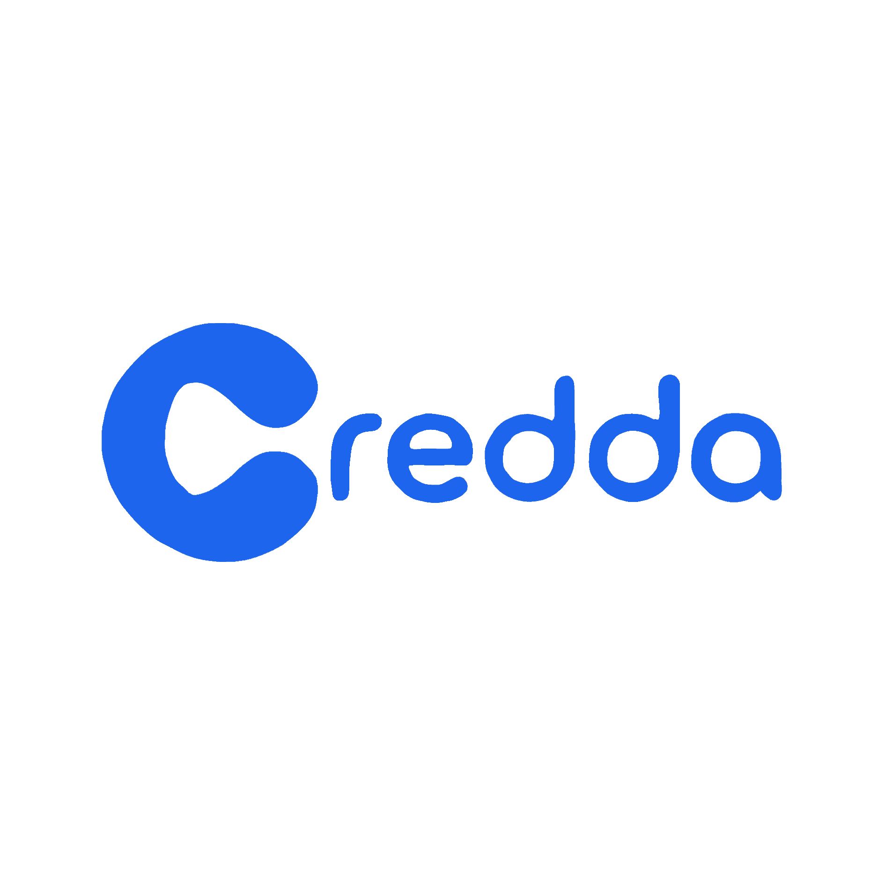

  

  ### Your verified work reputation — that you own, and present anywhere.

  Credda is a **deterministic, portable, counterparty-confirmed reliability record.**

  <a href="https://credda.io">credda.io</a>
  &nbsp;·&nbsp;
  <a href="https://api.credda.io">api.credda.io</a>
  &nbsp;·&nbsp;
  <a href="https://api.credda.io/docs">API reference</a>
  &nbsp;·&nbsp;
  <a href="https://api.credda.io/api/v1/scoring/model">the scoring model</a>

---

## What Credda is

Reputation today is trapped. Your track record lives inside whatever platform you
earned it on, in a format only that platform controls, and it does not travel with
you. Start somewhere new and you start from zero.

Credda unlocks it. Platforms report **immutable outcome events** — a contract
delivered on time, an invoice a client accepted, a completed marketplace job, a
merged pull request — and a single **pure function** turns that ledger into a
0–100 reliability record. The record is yours: you carry it between platforms,
present it with a cryptographically signed credential, and choose exactly what to
disclose.

It is built for **everyone who does work someone else depends on** — freelancers,
contractors, gig and marketplace workers, software engineers, small businesses,
and (increasingly) autonomous agents. Not one profession; a portable professional
record for all of them.

> ### What Credda is not
> Credda does **not** rate, judge, screen, or decide anything about a person. It
> **verifies and records evidence**; whoever is reading it decides what to do with
> what they see. There is deliberately **no "should I hire / lend / trust this
> person" verdict anywhere in the product** — not from a human, not from an AI.
> That is a design guarantee, not a missing feature.

## How it works

1. **Outcomes get recorded.** Platforms report events to an append-only ledger.
   An outcome only counts as *verified* when a party **other than the subject**
   witnessed it — a client who confirmed delivery, a marketplace that ran the job,
   a merge someone else approved. Self-attestation is recorded but never counts as
   verified.
2. **A pure function computes the record.** The score is a deterministic function
   of the ledger. No human and no AI can nudge it. The whole formula is public and
   live at [`GET /api/v1/scoring/model`](https://api.credda.io/api/v1/scoring/model)
   — the moat is not the formula, it is the density of confirmed outcomes.
3. **You own it and present it.** Issue a W3C Verifiable Credential, verifiable
   offline against our `did:web` issuer, revocable, wallet-compatible via OID4VCI
   with SD-JWT selective disclosure. Share a scoped, revocable link or an
   embeddable badge — full record, band only, or minimal.

## The scoring model (v5.3) — published, not proprietary

| Factor | Weight | Measures |
| --- | --- | --- |
| **Completion Rate** | 40% | Positively resolved outcomes, weighted by stake and value |
| **On-Time Rate** | 35% | Punctuality, with a days-late penalty and recency decay |
| **Dispute Ratio** | 15% | Disputes, severity-weighted, against a floor |
| **Verification Depth** | 10% | The share of the record independently verified by a third party |

A record begins **unproven** and is earned upward. Verified outcomes unlock the
top of the scale; a record built only on unverified activity caps around "Fair".
A single serious breach drops the record sharply — a high score has to be earned
and is not cushioned on the way down. Verification Depth rewards *how much* of your
record is third-party-confirmed, on any number of platforms — it does not reward
breadth for its own sake, and a fully-verified record on a single platform earns
full marks.

## Trust guarantees

These are the lines we do not cross. We publish them because a trust record is
only as good as the guarantees behind it.

- **Deterministic and bias-free.** No human and no AI decides a score. There is no
  manual override, no adjustment dial, and no adjudicated appeal — a dispute
  resolves by the same deterministic rules as everything else.
- **A score cannot be bought.** A paid plan governs API access only. No tier, and
  no amount of money, can move anyone's record.
- **Worker-owned and portable.** Portability and consent are first-class. You hold
  your credential, you choose what to disclose, and you can revoke it.
- **Never a verdict on a person.** We explain evidence; we never render a
  recommendation about a human being.
- **A third-party witness is required.** `isVerified` is never granted to a party
  vouching for itself. A bare payment is not trust; a self-confirmed job is not
  trust.

## Build on Credda

Everything is contract-first, documented in
[OpenAPI 3.1](https://api.credda.io/openapi.json) and rendered at
[`/docs`](https://api.credda.io/docs).

| | |
| --- | --- |
| **SDKs** | [`@credda/js`](https://www.npmjs.com/package/@credda/js) (TypeScript), plus Python and Go clients |
| **CLI** | [`@credda/cli`](https://www.npmjs.com/package/@credda/cli) — look up, verify, export, report events |
| **MCP server** | [`@credda/mcp-server`](https://www.npmjs.com/package/@credda/mcp-server) — on npm and in the [MCP Registry](https://registry.modelcontextprotocol.io); lets any MCP-aware agent check a counterparty's trust or present its own, mid-reasoning |
| **Automation** | Outbound HMAC-signed webhooks, a continuous-monitor wedge, and an n8n community node |
| **Ingest** | `POST /events` (+ batch), a declarative field-mapping `/ingest`, and CSV `/imports` |

## Interoperability, stated honestly

Credda implements open standards so your record is not locked to us: **W3C
Verifiable Credentials**, **OID4VCI 1.0** issuance with **SD-JWT VC** selective
disclosure, **did:web**, **StatusList2021** revocation, **Open Badges 3.0**
mapping, the **Model Context Protocol**, and **RFC 9421** Web Bot Auth webhook
signing.

Being *interoperable with* a standard or a wallet is not the same as being
*partnered with* or *endorsed by* anyone. We claim no partnership, endorsement, or
official relationship with any platform, wallet vendor, or standards body.

## Where we are

Credda is **pre-launch**. We do not publish user counts, customer names, revenue,
or funding, because we would rather say nothing than say something we cannot stand
behind. The scoring service, web app, credential fabric, and developer platform
are live at the links above.

Security and compliance **readiness** work (GLBA Safeguards Rule, SOC 2) is **in
progress**. Credda is not certified or attested against either framework, and we
will not describe it as such until an auditor says so.

## Security

Found a vulnerability? See our [security policy](../SECURITY.md) and email
**martin@credda.io** (subject “Security disclosure”). Please do not open a public issue for a security report.

   
  Built in the open about how it works, closed about your data. 
  Your trust, your record, your call.

